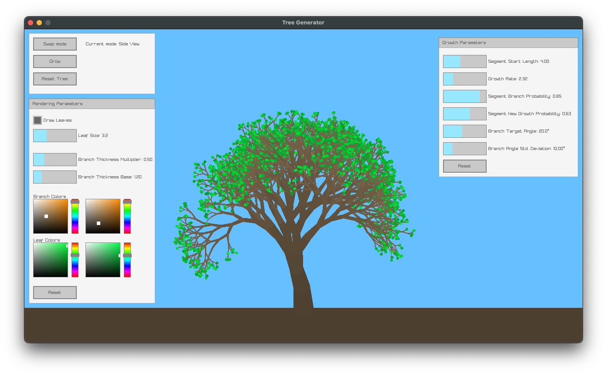
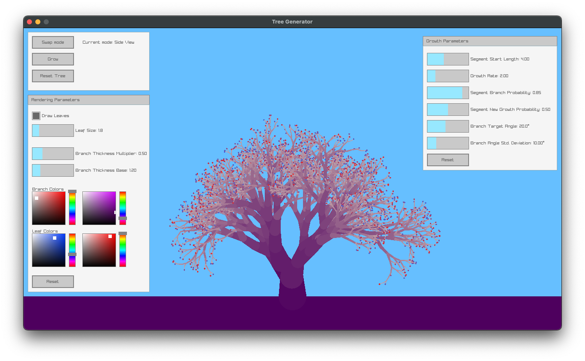
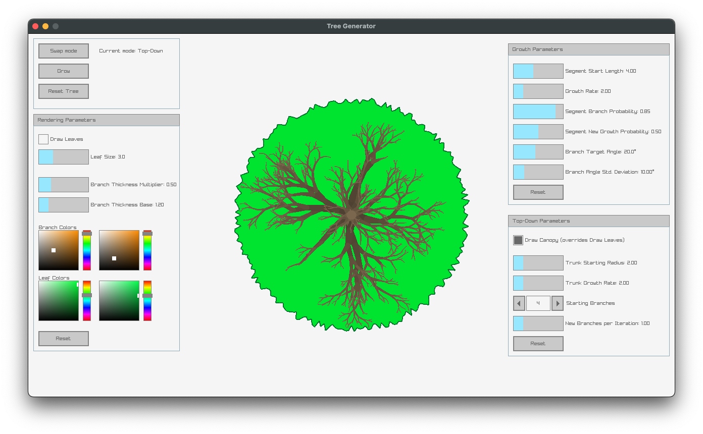
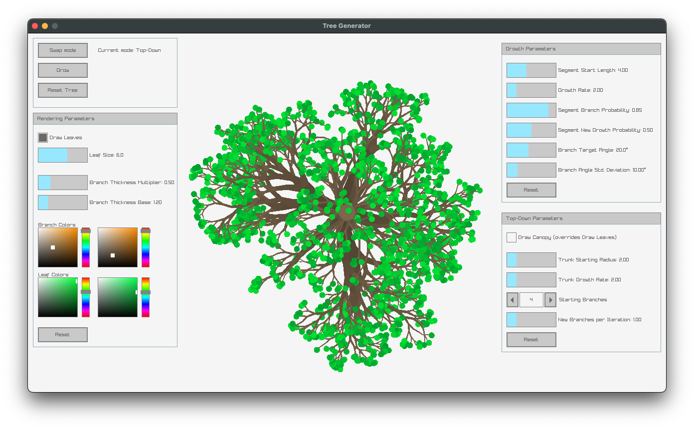

# Tree Generator

This is a 2D tree generator based on stochastic L-systems. Though at present it has support for only a limited range of rules, a wider variety can be supported without great difficulty. L-system rules are not explicitly represented in the implementation, which instead uses recursion. Two modes are supported, one for side-view and another for top-down-view trees. The most important parameters can all be controlled via a GUI at runtime.

Web demo [here](https://colinmcculloughbenner.github.io/tree-generator-demo/).

